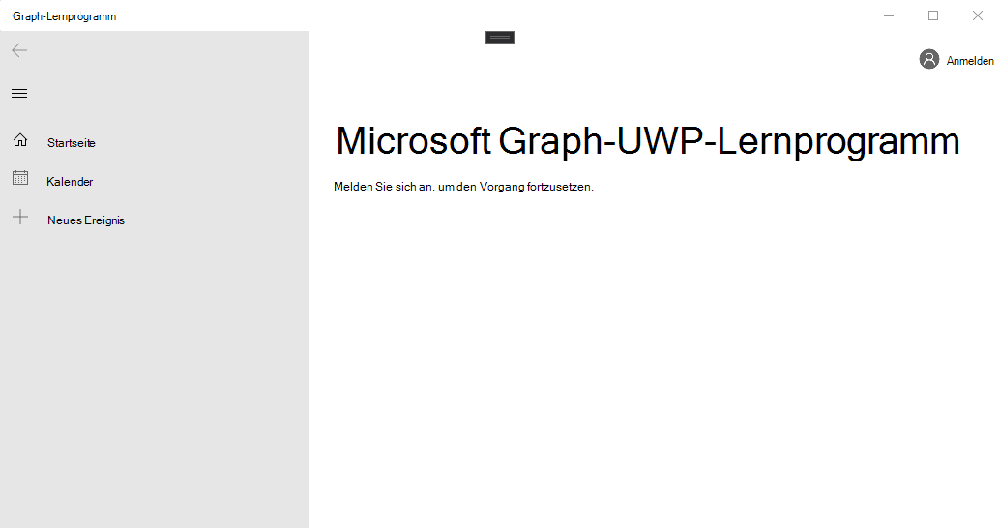

<!-- markdownlint-disable MD002 MD041 -->

Öffnen Sie Visual Studio, und wählen Sie **Neues Projekt erstellen**aus. Wählen Sie die Option **leere app (universelle Windows)** aus, die C# verwendet, und wählen Sie dann **weiter**aus.


Geben Sie im Dialogfeld **Neues Projekt konfigurieren** in `graph-tutorial` das Feld **Projektname** ein, und wählen Sie dann **Erstellen**aus.


> [!IMPORTANT]
> Stellen Sie sicher, dass Sie genau den gleichen Namen für das Visual Studio Projekt eingeben, das in diesen Übungseinheiten angegeben ist. Der Visual Studio Projektname wird Teil des Namespaces im Code. Der Code in diesen Anweisungen hängt vom Namespace ab, der dem in diesen Anweisungen angegebenen Visual Studio Projektnamen entspricht. Wenn Sie einen anderen Projektnamen verwenden, wird der Code nur dann kompiliert, wenn Sie alle Namespaces so anpassen, dass Sie dem Visual Studio Projektnamen entsprechen, den Sie beim Erstellen des Projekts eingeben.

Wählen Sie **OK** aus. Stellen Sie im Dialogfeld **Neues universelles Windows-Platt Form Projekt** sicher, dass die `Windows 10 Fall Creators Update (10.0; Build 16299)` **minimale Version** auf oder höher festgelegt ist, und wählen Sie **OK**aus.

Bevor Sie fortfahren, installieren Sie einige zusätzliche NuGet-Pakete, die Sie später verwenden werden.

- [Microsoft. Toolkit. UWP. UI. Controls](https://www.nuget.org/packages/Microsoft.Toolkit.Uwp.Ui.Controls/) zum Hinzufügen einiger UI-Steuerelemente für in-App-Benachrichtigungen und lade Indikatoren.
- [Microsoft. Toolkit. UWP. UI. Controls. DataGrid](https://www.nuget.org/packages/Microsoft.Toolkit.Uwp.Ui.Controls.DataGrid/) zum Anzeigen der von Microsoft Graph zurückgegebenen Informationen.
- [Microsoft. Toolkit. UWP. UI. Controls. Graph](https://www.nuget.org/packages/Microsoft.Toolkit.Uwp.Ui.Controls.Graph/) zur Behandlung von Anmelde-und Zugriffstoken abrufen.
- [Microsoft. Graph](https://www.nuget.org/packages/Microsoft.Graph/) für das tätigen von Anrufen an Microsoft Graph.

Wählen Sie **Tools #a0 NuGet-Paket-Manager #a1-Paket-Manager-Konsole**aus. Geben Sie in der Paket-Manager-Konsole die folgenden Befehle ein.

```Powershell
Install-Package Microsoft.Toolkit.Uwp.Ui.Controls -Version 5.1.1
Install-Package Microsoft.Toolkit.Uwp.Ui.Controls.DataGrid -Version 5.1.0
Install-Package Microsoft.Toolkit.Uwp.Ui.Controls.Graph -Version 5.1.0
Install-Package Microsoft.Graph -Version 1.16.0
```

## <a name="design-the-app"></a>Entwerfen der APP

Fügen Sie zunächst eine Variable auf Anwendungsebene hinzu, um den Authentifizierungsstatus nachzuverfolgen. Erweitern Sie im Projektmappen-Explorer den Knoten **app. XAML** , und öffnen Sie **app.XAML.cs**. Fügen Sie der- `App` Klasse die folgende Eigenschaft hinzu.

```cs
public bool IsAuthenticated { get; set; }
```

Definieren Sie als nächstes das Layout für die Hauptseite. Öffnen `MainPage.xaml` Sie den gesamten Inhalt, und ersetzen Sie ihn durch Folgendes.

```xml
<Page
    x:Class="graph_tutorial.MainPage"
    xmlns="http://schemas.microsoft.com/winfx/2006/xaml/presentation"
    xmlns:x="http://schemas.microsoft.com/winfx/2006/xaml"
    xmlns:local="using:graph_tutorial"
    xmlns:d="http://schemas.microsoft.com/expression/blend/2008"
    xmlns:mc="http://schemas.openxmlformats.org/markup-compatibility/2006"
    xmlns:controls="using:Microsoft.Toolkit.Uwp.UI.Controls"
    xmlns:graphControls="using:Microsoft.Toolkit.Uwp.UI.Controls.Graph"
    mc:Ignorable="d"
    Background="{ThemeResource ApplicationPageBackgroundThemeBrush}">

    <Grid>
        <NavigationView x:Name="NavView"
            IsSettingsVisible="False"
            ItemInvoked="NavView_ItemInvoked">

            <NavigationView.Header>
                <graphControls:AadLogin x:Name="Login"
                    HorizontalAlignment="Left"
                    View="SmallProfilePhotoLeft"
                    AllowSignInAsDifferentUser="False"
                    />
            </NavigationView.Header>

            <NavigationView.MenuItems>
                <NavigationViewItem Content="Home" x:Name="Home" Tag="home">
                    <NavigationViewItem.Icon>
                        <FontIcon Glyph="&#xE10F;"/>
                    </NavigationViewItem.Icon>
                </NavigationViewItem>
                <NavigationViewItem Content="Calendar" x:Name="Calendar" Tag="calendar">
                    <NavigationViewItem.Icon>
                        <FontIcon Glyph="&#xE163;"/>
                    </NavigationViewItem.Icon>
                </NavigationViewItem>
            </NavigationView.MenuItems>

            <StackPanel>
                <controls:InAppNotification x:Name="Notification" ShowDismissButton="true" />
                <Frame x:Name="RootFrame" Margin="24, 0" />
            </StackPanel>
        </NavigationView>
    </Grid>
</Page>
```

Dies definiert eine grundlegende [NavigationView](https://docs.microsoft.com/uwp/api/windows.ui.xaml.controls.navigationview) mit **Start** -und **Kalender** Navigationslinks, die als Hauptansicht der APP fungieren. Außerdem wird ein [AadLogin](https://docs.microsoft.com/dotnet/api/microsoft.toolkit.uwp.ui.controls.graph.aadlogin?view=win-comm-toolkit-dotnet-stable) -Steuerelement in der Kopfzeile der Ansicht hinzugefügt. Mit diesem Steuerelement kann sich der Benutzer an-und abmelden. Das Steuerelement ist noch nicht vollständig aktiviert, Sie werden es in einer späteren Übung konfigurieren.

Fügen Sie nun eine weitere XAML-Seite für die Ansicht Home hinzu. Klicken Sie mit der rechten Maustaste auf das **Graph-Tutorial-** Projekt im Projektmappen-Explorer, und wählen Sie **#a0 neues Element hinzufügen aus...**. Wählen Sie **leere Seite**aus `HomePage.xaml` , geben Sie in das Feld **Name** ein, und wählen Sie **Hinzufügen**aus. Fügen Sie den folgenden Code innerhalb `<Grid>` des-Elements in der Datei hinzu.

```xml
<StackPanel>
    <TextBlock FontSize="44" FontWeight="Bold" Margin="0, 12">Microsoft Graph UWP Tutorial</TextBlock>
    <TextBlock x:Name="HomePageMessage">Please sign in to continue.</TextBlock>
</StackPanel>
```

Erweitern Sie nun Haupt **. XAML** im Projektmappen `MainPage.xaml.cs`-Explorer, und öffnen Sie. Fügen Sie der `MainPage` Klasse die folgende Funktion hinzu, um den Authentifizierungsstatus zu verwalten.

```cs
private void SetAuthState(bool isAuthenticated)
{
    (App.Current as App).IsAuthenticated = isAuthenticated;

    // Toggle controls that require auth
    Calendar.IsEnabled = isAuthenticated;
}
```

Fügen Sie dem `MainPage()` Konstruktor **nach** der `this.InitializeComponent();` -Verbindung den folgenden Code hinzu.

```cs
// Initialize auth state to false
SetAuthState(false);

// Navigate to HomePage.xaml
RootFrame.Navigate(typeof(HomePage));
```

Wenn die APP erstmalig gestartet wird, wird der Authentifizierungsstatus in `false` initialisiert und zur Startseite navigiert.

Fügen Sie den folgenden Ereignishandler hinzu, um die angeforderte Seite zu laden, wenn der Benutzer ein Element aus der Navigationsansicht auswählt.

```cs
private void NavView_ItemInvoked(NavigationView sender, NavigationViewItemInvokedEventArgs args)
{
    var invokedItem = args.InvokedItem as string;

    switch (invokedItem.ToLower())
    {
        case "calendar":
            throw new NotImplementedException();
            break;
        case "home":
        default:
            RootFrame.Navigate(typeof(HomePage));
            break;
    }
}
```

Speichern Sie alle Änderungen, drücken Sie **F5** , oder wählen Sie **Debug #a0 starten** des Debuggings in Visual Studio.

> [!NOTE]
> Stellen Sie sicher, dass Sie die entsprechende Konfiguration für Ihren Computer auswählen (Arm, x64, x86).


