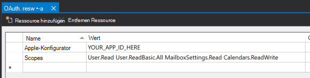

<!-- markdownlint-disable MD002 MD041 -->

In dieser Übung erweitern Sie die Anwendung aus der vorherigen Übung, um die Authentifizierung mit Azure AD zu unterstützen. Dies ist erforderlich, um das erforderliche OAuth-Zugriffstoken zum Aufrufen von Microsoft Graph zu erhalten. In diesem Schritt werden Sie das **LoginButton** -Steuerelement aus den [Windows Graph-Steuerelementen](https://github.com/windows-toolkit/Graph-Controls) in die Anwendung integrieren.

1. Klicken Sie mit der rechten Maustaste auf das **GraphTutorial** -Projekt im Projektmappen-Explorer, und wählen Sie **> neues Element hinzufügen**aus. Wählen Sie **Ressourcendatei (. resw)**, benennen Sie `OAuth.resw` die Datei, und wählen Sie **Hinzufügen**aus. Wenn die neue Datei in Visual Studio geöffnet wird, erstellen Sie zwei Ressourcen wie folgt.

    - **Name:** `AppId`, **Wert:** die APP-ID, die Sie im Anwendungs Registrierungs Portal generiert haben.
    - **Name:** `Scopes`, **Wert:**`User.Read Calendars.Read`

    

    > [!IMPORTANT]
    > Wenn Sie die Quellcodeverwaltung wie git verwenden, wäre es jetzt ein guter Zeitpunkt, die Datei `OAuth.resw` aus der Quellcodeverwaltung auszuschließen, um unbeabsichtigtes Auslaufen ihrer APP-ID zu vermeiden.

## <a name="configure-the-loginbutton-control"></a>Konfigurieren des LoginButton-Steuerelements

1. Öffnen `MainPage.xaml.cs` Sie und fügen Sie `using` die folgende Anweisung am Anfang der Datei hinzu.

    ```csharp
    using Microsoft.Toolkit.Graph.Providers;
    ```

1. Ersetzen Sie den vorhandenen Konstruktor durch Folgendes.

    :::code language="csharp" source="../demo/GraphTutorial/MainPage.xaml.cs" id="ConstructorSnippet":::

    Dieser Code lädt die Einstellungen aus `OAuth.resw` und initialisiert den MSAL-Anbieter mit diesen Werten.

1. Fügen Sie nun einen Ereignishandler für `ProviderUpdated` das Ereignis auf `ProviderManager`der hinzu. Fügen Sie die folgende Funktion zur `MainPage`-Klasse hinzu:

    :::code language="csharp" source="../demo/GraphTutorial/MainPage.xaml.cs" id="ProviderUpdatedSnippet":::

    Dieses Ereignis wird ausgelöst, wenn sich der Anbieter ändert oder wenn sich der Anbieterstatus ändert.

1. Erweitern Sie im Projektmappen-Explorer **Homepage. XAML** , und öffnen `HomePage.xaml.cs`Sie. Ersetzen Sie den vorhandenen Konstruktor durch Folgendes.

    :::code language="csharp" source="../demo/GraphTutorial/HomePage.xaml.cs" id="ConstructorSnippet":::

1. Starten Sie die APP neu, und klicken Sie oben in der APP auf das **Anmelde** Steuerelement. Nachdem Sie sich angemeldet haben, sollte die Benutzeroberfläche geändert werden, um anzugeben, dass Sie sich erfolgreich angemeldet haben.

    

    > [!NOTE]
    > Das `ButtonLogin` Steuerelement implementiert die Logik des Speicherns und Aktualisierens des Zugriffstokens für Sie. Die Token werden im sicheren Speicher gespeichert und bei Bedarf aktualisiert.
