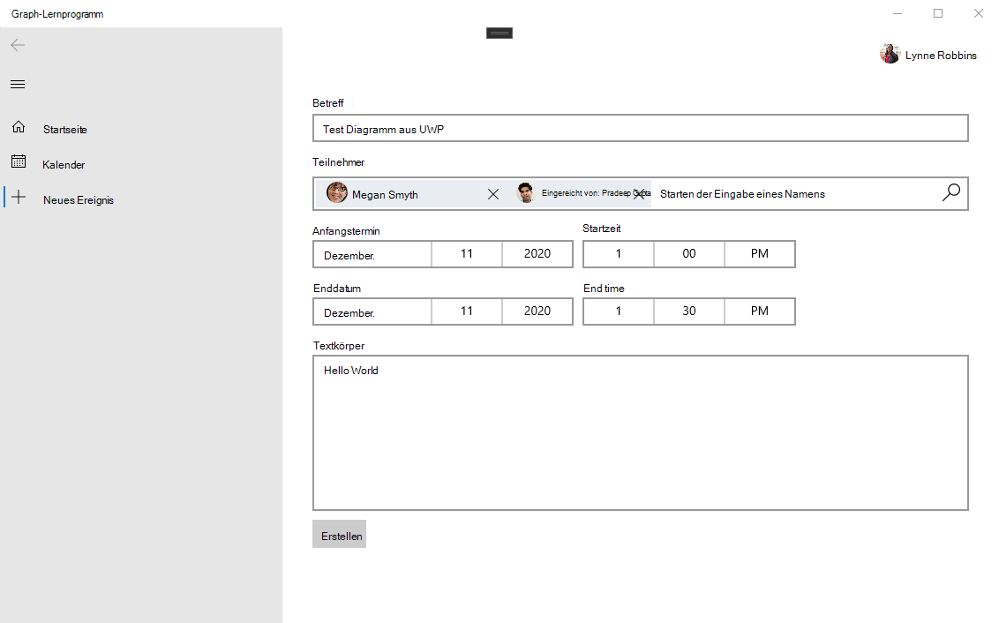

<!-- markdownlint-disable MD002 MD041 -->

In diesem Abschnitt können Sie die Möglichkeit zum Erstellen von Ereignissen im Kalender des Benutzers hinzufügen.

1. Fügen Sie eine neue Seite für die neue Ereignisansicht hinzu. Klicken Sie mit der rechten Maustaste auf das **GraphTutorial** -Projekt im Projektmappen-Explorer, und wählen Sie **> neues Element hinzufügen** aus. Wählen Sie **leere Seite** aus, geben Sie `NewEventPage.xaml` in das Feld **Name** ein, und wählen Sie **Hinzufügen** aus.

1. Öffnen Sie **NewEventPage. XAML** , und ersetzen Sie den Inhalt durch Folgendes.

    :::code language="xaml" source="../demo/GraphTutorial/NewEventPage.xaml" id="NewEventPageXamlSnippet":::

1. Öffnen Sie **NewEventPage.XAML.cs** , und fügen Sie die folgenden `using` Anweisungen am Anfang der Datei hinzu.

    :::code language="csharp" source="../demo/GraphTutorial/NewEventPage.xaml.cs" id="UsingStatementsSnippet":::

1. Fügen Sie die **INotifyPropertyChange** -Schnittstelle zur **NewEventPage** -Klasse hinzu. Ersetzen Sie die vorhandene Klassendeklaration durch Folgendes.

    ```csharp
    public sealed partial class NewEventPage : Page, INotifyPropertyChanged
    {
        public NewEventPage()
        {
            this.InitializeComponent();
            DataContext = this;
        }
    }
    ```

1. Fügen Sie der **NewEventPage** -Klasse die folgenden Eigenschaften hinzu.

    :::code language="csharp" source="../demo/GraphTutorial/NewEventPage.xaml.cs" id="PropertiesSnippet":::

1. Fügen Sie den folgenden Code hinzu, um die Zeitzone des Benutzers aus Microsoft Graph abzurufen, wenn die Seite geladen wird.

    :::code language="csharp" source="../demo/GraphTutorial/NewEventPage.xaml.cs" id="LoadTimeZoneSnippet":::

1. Fügen Sie den folgenden Code hinzu, um das Ereignis zu erstellen.

    :::code language="csharp" source="../demo/GraphTutorial/NewEventPage.xaml.cs" id="CreateEventSnippet":::

1. Ändern `NavView_ItemInvoked` Sie die-Methode in der **MainPage.XAML.cs** -Datei, um die vorhandene `switch` Anweisung durch Folgendes zu ersetzen.

    ```csharp
    switch (invokedItem.ToLower())
    {
        case "new event":
            RootFrame.Navigate(typeof(NewEventPage));
            break;
        case "calendar":
            RootFrame.Navigate(typeof(CalendarPage));
            break;
        case "home":
        default:
            RootFrame.Navigate(typeof(HomePage));
            break;
    }
    ```

1. Speichern Sie die Änderungen, und führen Sie die App aus. Melden Sie sich an, wählen Sie das Menüelement **neuer Ereignis** aus, füllen Sie das Formular aus, und wählen Sie **Erstellen** aus, um dem Kalender des Benutzers ein Ereignis hinzuzufügen.

    
