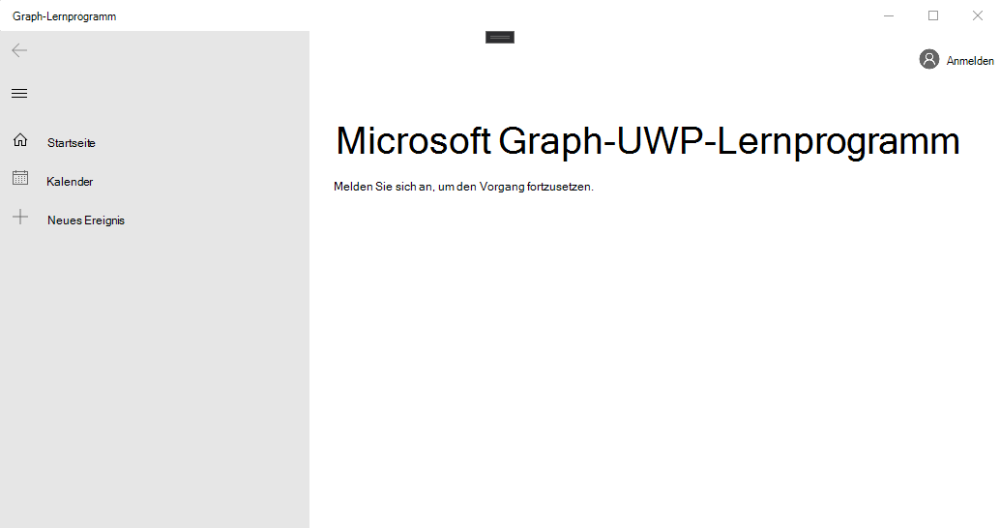

<!-- markdownlint-disable MD002 MD041 -->

<span data-ttu-id="c8def-101">Öffnen Sie Visual Studio, und wählen Sie **Datei > neues >-Projekt**aus.</span><span class="sxs-lookup"><span data-stu-id="c8def-101">Open Visual Studio, and select **File > New > Project**.</span></span> <span data-ttu-id="c8def-102">Führen Sie im Dialogfeld **Neues Projekt** folgende Aktionen aus:</span><span class="sxs-lookup"><span data-stu-id="c8def-102">In the **New Project** dialog, do the following:</span></span>

1. <span data-ttu-id="c8def-103">Wählen Sie **Vorlagen > Visual C# > Windows Universal**aus.</span><span class="sxs-lookup"><span data-stu-id="c8def-103">Select **Templates > Visual C# > Windows Universal**.</span></span>
1. <span data-ttu-id="c8def-104">Wählen Sie **leere app (universelle Fenster)** aus.</span><span class="sxs-lookup"><span data-stu-id="c8def-104">Select **Blank App (Universal Windows)**.</span></span>
1. <span data-ttu-id="c8def-105">Geben Sie **Graph-Tutorial** als Namen für das Projekt ein.</span><span class="sxs-lookup"><span data-stu-id="c8def-105">Enter **graph-tutorial** for the Name of the project.</span></span>


> [!IMPORTANT]
> <span data-ttu-id="c8def-107">Stellen Sie sicher, dass Sie genau denselben Namen für das Visual Studio-Projekt eingeben, das in diesen Lab-Anweisungen angegeben ist.</span><span class="sxs-lookup"><span data-stu-id="c8def-107">Ensure that you enter the exact same name for the Visual Studio Project that is specified in these lab instructions.</span></span> <span data-ttu-id="c8def-108">Der Visual Studio-Projektname wird Teil des Namespaces im Code.</span><span class="sxs-lookup"><span data-stu-id="c8def-108">The Visual Studio Project name becomes part of the namespace in the code.</span></span> <span data-ttu-id="c8def-109">Der Code in diesen Anweisungen hängt vom Namespace ab, der dem in diesen Anweisungen angegebenen Visual Studio-Projektnamen entspricht.</span><span class="sxs-lookup"><span data-stu-id="c8def-109">The code inside these instructions depends on the namespace matching the Visual Studio Project name specified in these instructions.</span></span> <span data-ttu-id="c8def-110">Wenn Sie einen anderen Projektnamen verwenden, wird der Code nicht kompiliert, es sei denn, Sie passen alle Namespaces so an, dass Sie mit dem Visual Studio-Projektnamen übereinstimmen, den Sie beim Erstellen des Projekts eingeben.</span><span class="sxs-lookup"><span data-stu-id="c8def-110">If you use a different project name the code will not compile unless you adjust all the namespaces to match the Visual Studio Project name you enter when you create the project.</span></span>

<span data-ttu-id="c8def-111">Wählen Sie **OK** aus.</span><span class="sxs-lookup"><span data-stu-id="c8def-111">Select **OK**.</span></span> <span data-ttu-id="c8def-112">Stellen Sie im Dialogfeld **neues Windows-Platt Form Projekt** sicher \*\*\*\* , dass die Mindestversion `Windows 10 Fall Creators Update (10.0; Build 16299)` auf oder höher festgelegt ist, und wählen Sie **OK**aus.</span><span class="sxs-lookup"><span data-stu-id="c8def-112">In the **New Universal Windows Platform Project** dialog, ensure that the **Minimum version** is set to `Windows 10 Fall Creators Update (10.0; Build 16299)` or later and select **OK**.</span></span>

<span data-ttu-id="c8def-113">Bevor Sie fortfahren, installieren Sie einige zusätzliche NuGet-Pakete, die Sie später verwenden werden.</span><span class="sxs-lookup"><span data-stu-id="c8def-113">Before moving on, install some additional NuGet packages that you will use later.</span></span>

- <span data-ttu-id="c8def-114">[Microsoft. Toolkit. UWP. UI. Controls](https://www.nuget.org/packages/Microsoft.Toolkit.Uwp.Ui.Controls/) zum Hinzufügen einiger UI-Steuerelemente für in-App-Benachrichtigungen und lade Indikatoren.</span><span class="sxs-lookup"><span data-stu-id="c8def-114">[Microsoft.Toolkit.Uwp.Ui.Controls](https://www.nuget.org/packages/Microsoft.Toolkit.Uwp.Ui.Controls/) to add some UI controls for in-app notifications and loading indicators.</span></span>
- <span data-ttu-id="c8def-115">[Microsoft. Toolkit. UWP. UI. Controls. DataGrid](https://www.nuget.org/packages/Microsoft.Toolkit.Uwp.Ui.Controls.DataGrid/) , um die von Microsoft Graph zurückgegebenen Informationen anzuzeigen.</span><span class="sxs-lookup"><span data-stu-id="c8def-115">[Microsoft.Toolkit.Uwp.Ui.Controls.DataGrid](https://www.nuget.org/packages/Microsoft.Toolkit.Uwp.Ui.Controls.DataGrid/) to display the information returned by Microsoft Graph.</span></span>
- <span data-ttu-id="c8def-116">[Microsoft. Toolkit. UWP. UI. Controls. Graph](https://www.nuget.org/packages/Microsoft.Toolkit.Uwp.Ui.Controls.Graph/) , um den Anmelde-und Zugriffstoken Abruf zu behandeln.</span><span class="sxs-lookup"><span data-stu-id="c8def-116">[Microsoft.Toolkit.Uwp.Ui.Controls.Graph](https://www.nuget.org/packages/Microsoft.Toolkit.Uwp.Ui.Controls.Graph/) to handle login and access token retrieval.</span></span>
- <span data-ttu-id="c8def-117">[Microsoft. Graph](https://www.nuget.org/packages/Microsoft.Graph/) für Aufrufe von Microsoft Graph.</span><span class="sxs-lookup"><span data-stu-id="c8def-117">[Microsoft.Graph](https://www.nuget.org/packages/Microsoft.Graph/) for making calls to the Microsoft Graph.</span></span>

<span data-ttu-id="c8def-118">Wählen Sie **Extras > NuGet Paket-Manager > Paket-Manager-Konsole**aus.</span><span class="sxs-lookup"><span data-stu-id="c8def-118">Select **Tools > NuGet Package Manager > Package Manager Console**.</span></span> <span data-ttu-id="c8def-119">Geben Sie in der Paket-Manager-Konsole die folgenden Befehle ein.</span><span class="sxs-lookup"><span data-stu-id="c8def-119">In the Package Manager Console, enter the following commands.</span></span>

```Powershell
Install-Package Microsoft.Toolkit.Uwp.Ui.Controls
Install-Package Microsoft.Toolkit.Uwp.Ui.Controls.DataGrid
Install-Package Microsoft.Toolkit.Uwp.Ui.Controls.Graph
Install-Package Microsoft.Graph
```

## <a name="design-the-app"></a><span data-ttu-id="c8def-120">Entwerfen der APP</span><span class="sxs-lookup"><span data-stu-id="c8def-120">Design the app</span></span>

<span data-ttu-id="c8def-121">Beginnen Sie, indem Sie eine Variable auf Anwendungsebene hinzufügen, um den Authentifizierungsstatus nachzuverfolgen.</span><span class="sxs-lookup"><span data-stu-id="c8def-121">Start by adding an application-level variable to track authentication state.</span></span> <span data-ttu-id="c8def-122">Erweitern Sie im Projektmappen-Explorer **app. XAML** , und öffnen Sie **app.XAML.cs**.</span><span class="sxs-lookup"><span data-stu-id="c8def-122">In Solution Explorer, expand **App.xaml** and open **App.xaml.cs**.</span></span> <span data-ttu-id="c8def-123">Fügen Sie der `App` Klasse die folgende Eigenschaft hinzu.</span><span class="sxs-lookup"><span data-stu-id="c8def-123">Add the following property to the `App` class.</span></span>

```cs
public bool IsAuthenticated { get; set; }
```

<span data-ttu-id="c8def-124">Definieren Sie als nächstes das Layout für die Hauptseite.</span><span class="sxs-lookup"><span data-stu-id="c8def-124">Next, define the layout for the main page.</span></span> <span data-ttu-id="c8def-125">Öffnen `MainPage.xaml` Sie den gesamten Inhalt, und ersetzen Sie ihn durch Folgendes.</span><span class="sxs-lookup"><span data-stu-id="c8def-125">Open `MainPage.xaml` and replace its entire contents with the following.</span></span>

```xml
<Page
    x:Class="graph_tutorial.MainPage"
    xmlns="http://schemas.microsoft.com/winfx/2006/xaml/presentation"
    xmlns:x="http://schemas.microsoft.com/winfx/2006/xaml"
    xmlns:local="using:graph_tutorial"
    xmlns:d="http://schemas.microsoft.com/expression/blend/2008"
    xmlns:mc="http://schemas.openxmlformats.org/markup-compatibility/2006"
    xmlns:controls="using:Microsoft.Toolkit.Uwp.UI.Controls"
    xmlns:graphControls="using:Microsoft.Toolkit.Uwp.UI.Controls.Graph"
    mc:Ignorable="d"
    Background="{ThemeResource ApplicationPageBackgroundThemeBrush}">

    <Grid>
        <NavigationView x:Name="NavView"
            IsSettingsVisible="False"
            ItemInvoked="NavView_ItemInvoked">

            <NavigationView.Header>
                <graphControls:AadLogin x:Name="Login"
                    HorizontalAlignment="Left"
                    View="SmallProfilePhotoLeft"
                    AllowSignInAsDifferentUser="False"
                    />
            </NavigationView.Header>

            <NavigationView.MenuItems>
                <NavigationViewItem Content="Home" x:Name="Home" Tag="home">
                    <NavigationViewItem.Icon>
                        <FontIcon Glyph="&#xE10F;"/>
                    </NavigationViewItem.Icon>
                </NavigationViewItem>
                <NavigationViewItem Content="Calendar" x:Name="Calendar" Tag="calendar">
                    <NavigationViewItem.Icon>
                        <FontIcon Glyph="&#xE163;"/>
                    </NavigationViewItem.Icon>
                </NavigationViewItem>
            </NavigationView.MenuItems>

            <StackPanel>
                <controls:InAppNotification x:Name="Notification" ShowDismissButton="true" />
                <Frame x:Name="RootFrame" Margin="24, 0" />
            </StackPanel>
        </NavigationView>
    </Grid>
</Page>
```

<span data-ttu-id="c8def-126">Dies definiert eine grundlegende [NavigationView](https://docs.microsoft.com/uwp/api/windows.ui.xaml.controls.navigationview) mit **Start** -und **Kalender** Navigationslinks, die als Hauptansicht der APP fungieren.</span><span class="sxs-lookup"><span data-stu-id="c8def-126">This defines a basic [NavigationView](https://docs.microsoft.com/uwp/api/windows.ui.xaml.controls.navigationview) with **Home** and **Calendar** navigation links to act as the main view of the app.</span></span> <span data-ttu-id="c8def-127">Außerdem wird ein [AadLogin](https://docs.microsoft.com/dotnet/api/microsoft.toolkit.uwp.ui.controls.graph.aadlogin?view=win-comm-toolkit-dotnet-stable) -Steuerelement in der Kopfzeile der Ansicht hinzugefügt.</span><span class="sxs-lookup"><span data-stu-id="c8def-127">It also adds an [AadLogin](https://docs.microsoft.com/dotnet/api/microsoft.toolkit.uwp.ui.controls.graph.aadlogin?view=win-comm-toolkit-dotnet-stable) control in the header of the view.</span></span> <span data-ttu-id="c8def-128">Dieses Steuerelement ermöglicht es dem Benutzer, sich anzumelden. Das Steuerelement ist noch nicht vollständig aktiviert, Sie werden es in einer späteren Übung konfigurieren.</span><span class="sxs-lookup"><span data-stu-id="c8def-128">That control will allow the user to sign in and out. The control isn't fully enabled yet, you will configure it in a later exercise.</span></span>

<span data-ttu-id="c8def-129">Fügen Sie nun eine weitere XAML-Seite für die Startansicht hinzu.</span><span class="sxs-lookup"><span data-stu-id="c8def-129">Now add another XAML page for the Home view.</span></span> <span data-ttu-id="c8def-130">Klicken Sie im Projektmappen-Explorer mit der rechten Maustaste auf das **Graph-Tutorial-** Projekt, und wählen Sie **> neues Element hinzufügen...**. Wählen Sie **leere Seite**aus `HomePage.xaml` , geben Sie in das Feld **Name** ein, und wählen Sie **Hinzufügen**aus.</span><span class="sxs-lookup"><span data-stu-id="c8def-130">Right-click the **graph-tutorial** project in Solution Explorer and choose **Add > New Item...**. Choose **Blank Page**, enter `HomePage.xaml` in the **Name** field, and choose **Add**.</span></span> <span data-ttu-id="c8def-131">Fügen Sie den folgenden Code innerhalb `<Grid>` des-Elements in der Datei hinzu.</span><span class="sxs-lookup"><span data-stu-id="c8def-131">Add the following code inside the `<Grid>` element in the file.</span></span>

```xml
<StackPanel>
    <TextBlock FontSize="44" FontWeight="Bold" Margin="0, 12">Microsoft Graph UWP Tutorial</TextBlock>
    <TextBlock x:Name="HomePageMessage">Please sign in to continue.</TextBlock>
</StackPanel>
```

<span data-ttu-id="c8def-132">Erweitern Sie nun "Haupt **. XAML** " im Projekt `MainPage.xaml.cs`Mappen-Explorer und öffnen.</span><span class="sxs-lookup"><span data-stu-id="c8def-132">Now expand **MainPage.xaml** in Solution Explorer and open `MainPage.xaml.cs`.</span></span> <span data-ttu-id="c8def-133">Fügen Sie dem `MainPage()` Konstruktor **nach** der `this.InitializeComponent();` Leitung den folgenden Code hinzu.</span><span class="sxs-lookup"><span data-stu-id="c8def-133">Add the following code to the `MainPage()` constructor **after** the `this.InitializeComponent();` line.</span></span>

```cs
// Initialize auth state to false
SetAuthState(false);

// Navigate to HomePage.xaml
RootFrame.Navigate(typeof(HomePage));
```

<span data-ttu-id="c8def-134">Wenn die APP zum ersten Mal gestartet wird, initialisiert Sie den Authentifizierungsstatus `false` und wechselt zur Homepage.</span><span class="sxs-lookup"><span data-stu-id="c8def-134">When the app first starts, it will initialize the authentication state to `false` and navigate to the home page.</span></span>

<span data-ttu-id="c8def-135">Fügen Sie der `MainPage` Klasse die folgende Funktion hinzu, um den Authentifizierungsstatus zu verwalten.</span><span class="sxs-lookup"><span data-stu-id="c8def-135">Add the following function to the `MainPage` class to manage authentication state.</span></span>

```cs
private void SetAuthState(bool isAuthenticated)
{
    (App.Current as App).IsAuthenticated = isAuthenticated;

    // Toggle controls that require auth
    Calendar.IsEnabled = isAuthenticated;
}
```

<span data-ttu-id="c8def-136">Fügen Sie den folgenden Ereignishandler hinzu, um die angeforderte Seite zu laden, wenn der Benutzer ein Element aus der Navigationsansicht auswählt.</span><span class="sxs-lookup"><span data-stu-id="c8def-136">Add the following event handler to load the requested page when the user selects an item from the navigation view.</span></span>

```cs
private void NavView_ItemInvoked(NavigationView sender, NavigationViewItemInvokedEventArgs args)
{
    var invokedItem = args.InvokedItem as string;

    switch (invokedItem.ToLower())
    {
        case "calendar":
            throw new NotImplementedException();
            break;
        case "home":
        default:
            RootFrame.Navigate(typeof(HomePage));
            break;
    }
}
```

<span data-ttu-id="c8def-137">Speichern Sie alle Änderungen, und drücken Sie **F5** , oder wählen Sie **Debug > Start Debugging** in Visual Studio.</span><span class="sxs-lookup"><span data-stu-id="c8def-137">Save all of your changes, then press **F5** or select **Debug > Start Debugging** in Visual Studio.</span></span>

> [!NOTE]
> <span data-ttu-id="c8def-138">Stellen Sie sicher, dass Sie die entsprechende Konfiguration für Ihren Computer (Arm, x64, x86) ausgewählt haben.</span><span class="sxs-lookup"><span data-stu-id="c8def-138">Make sure you select the appropriate configuration for your machine (ARM, x64, x86).</span></span>


